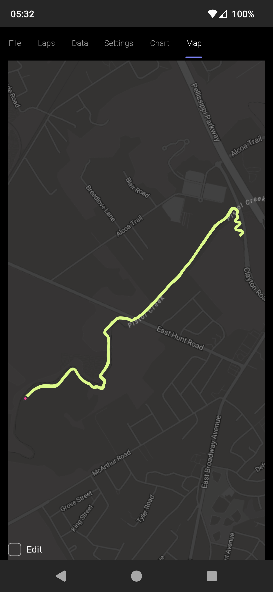

# FitEdit

[FitEdit](https://www.fitedit.io/) is a training data manager that keeps a local database of all your workouts.

# Platforms

FitEdit works on Windows, macOS, Linux, Android (Google Play), and iOS*. 

\* Currently on Apple Test Flight store. We hope to publish the iOS version soon. Meanwhile, contact us if you would like to be a tester.

# Releases

Releases are hosted on the [FitEdit website](https://www.fitedit.io/releases.html).

# Features

## Compatible

FitEdit works with Garmin FIT files and offers a native app experience on all your devices.

- Works on Windows, macOS (Intel and Apple Silicon), Linux, Android, and soon iOS
- Import FIT files
- Export FIT files
- Keep a local copy of all your activities
- Access your data any time, even without internet
- Supports all sports: run, bike, swim, walk, and many others

## User Interface

FitEdit has a beautiful and functional interface.

- Dark color scheme is easy on the eyes
- Attractive pastel colors
- Functional editing controls
- Edit detailed activity data with tables, text boxes, and drop-down menus
- Drill down to the data you're looking for with tabs and filters
- Visualize activity data with interactive charts and a zoomable, pannable map
- Drag GPS points on a map

## Edit

FitEdit can modify any FIT field: speed, heart rate, latitude, longitude, timestamp, and many others.

Example uses:

- GPS glitches
- Inaccurate speed (useful on treadmills!)
- Heart rate spikes
- Power drops
- Missed lap key
- Recalculate lap distances
- Merge, split, and trim activities

## Repair

FitEdit repairs corrupt or unuploadable files.

- Try three distinct repair strategies: Additive, Subtractive, and Backfill
- Fill in missing messages: Lap, Session, Activity
- Scan and recover lost records
- View raw byte data with built-in hex viewer

# Paid Features

## Synchronize

Syncs between your devices and with third-party fitness platforms.* **

- Sync activities between devices
- Import activities from other platforms
- Export activities to other platforms
- Sync activity name and description with other platforms
  
\* Currently supporting Garmin and Strava. 

\** Third-party features may break at any time as these platforms may change without notice. The most stable features use official platform APIs, while addtitional features use internal APIs.

## Official Integrations

Garmin and Strava each offer an official developer API. FitEdit is a member of both, and our backend is integrated with each.

 - [Garmin](https://developer.garmin.com/)
 - [Strava](https://developers.strava.com/)

You must authorize (give FitEdit permission) to access your data with these platforms. [Learn more](https://www.fitedit.io/support/integration-signin-terms.html)

After you've authorized FitEdit with Garmin, Garmin sends FitEdit server-to-server notifications when you upload activities and when you edit activities on Garmin Connect. Then, our servers push the notification to your running FitEdit app. You'll find that after your workout has uploaded to Garmin Connect, it shows in FitEdit shortly thereafter, and when you update an activity title or description on Garmin Connect, the change shows up in FitEdit a few seconds later. If the app isn't running, it will get all changes the next time it starts. 

After you've authorized FitEdit with Strava, it provides the same features described above for Garmin Connect.

## Unofficial Integrations

Unfortunately, the official Garmin API does not allow download of all activities in bulk* or to upload activities. For these features, you'll be interested in the unofficial integration.

In the app, you can sign in to Garmin by pasting a couple [cookies](https://www.fitedit.io/support/garmin-signin.html). The [browser extension](https://github.com/endurabyte/FitEdit.Browser) makes this very easy. Signing in like this provides these benefits:

- Upload activities to Garmin, from the app.
- Download past activities in bulk
- Delete Garmin Connect activities from the app

\* Garmin does allow backfilling of up to 5 years of activities. We do not (yet) support this feature, but you can backfill all activities without restriction using the unofficial integration.

Unfortunately, Strava does not expose activity downloads through their official API, downloading of past data, or to download in bulk**. For these features, you'll be interested in the unofficial integration.

You can sign into Strava with your username and password. Signing in like this provides these benefits:

- Download past activities in bulk
- Delete Strava activities from the app

\** Strava may temporarily block you for making too many requests. We'll notify you about this in the app. You can try again later.
